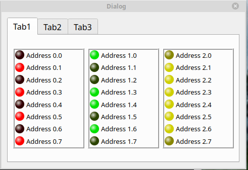

# MbWidgets

Modus widgets for QtDesigner (is written in C++ using the Qt library)
This project is designed to quickly create a simple form that allows you to work with a source of remote Modbus / TCP data;

To use these widgets, you just need to put them on the form, configure (address, etc.) in Qt Designer and add an implementation of the IOServer class. This will require a minimum amount of code.

Example below

Widgets which are implemented:

| Widget | Name | Description
| ------ | ------ |------ |
|  | **Led** | indicates ON or OFF state |
|  | **Message** | show text which depends on case value |
|  | **Indicator** | indicates value of register (bool, int or float format) |
|  | **MbButton** | button for writing a value to a register |

For using abilities of sending/receiving data according to the Modbus protocol we need following dependencies:
+ [**libmodbus**](https://libmodbus.org/)
+ [**IODriverLib**](https://libmodbus.org/)

### Building
(Limitations)
+ this works for release mode.
+ Shadow build mode is used.

##### Linux (Building using QtCreator, GCC)
1. Define path to QtDesigner plugins: **MX_INSTALL_PLUGINS** (common.pri);
2. Put library [**libmodbus**](https://libmodbus.org/) in folder **/import/libmodbus/lib/unix64/**
3. Put library [**libIODriver**](https://libmodbus.org/) in folder **/import/IODriverLib/lib/unix64/**
4. Set Qt Designer plugins directory by defining **MX_INSTALL_PLUGINS** variable in **common.pri**.
5. The first time you need to compile the project with the ** install ** option. You can remove this option later. (**install** option installs builded plugin to QtDesigner plugin directory)

##### Windows (Building using QtCreator, MinGW)
1. Define path to QtDesigner plugins: **MX_INSTALL_PLUGINS** (common.pri);
2. Put library [**libmodbus**](https://libmodbus.org/) in folder **/import/libmodbus/lib/win32/**
3. Put library [**libIODriver**](https://libmodbus.org/) in folder **/import/IODriverLib/lib/win32/**
4. Compile the **plugin** subproject using the compiler that built the Qt Designer (with **install** option). In Windows it is more likely the MSVS compiler.
5. Compile the project with the MinGW compiler (without **install** option).